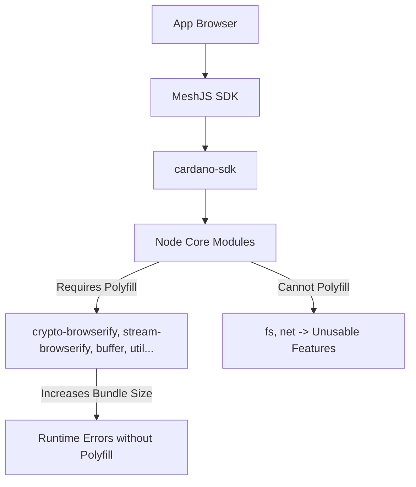
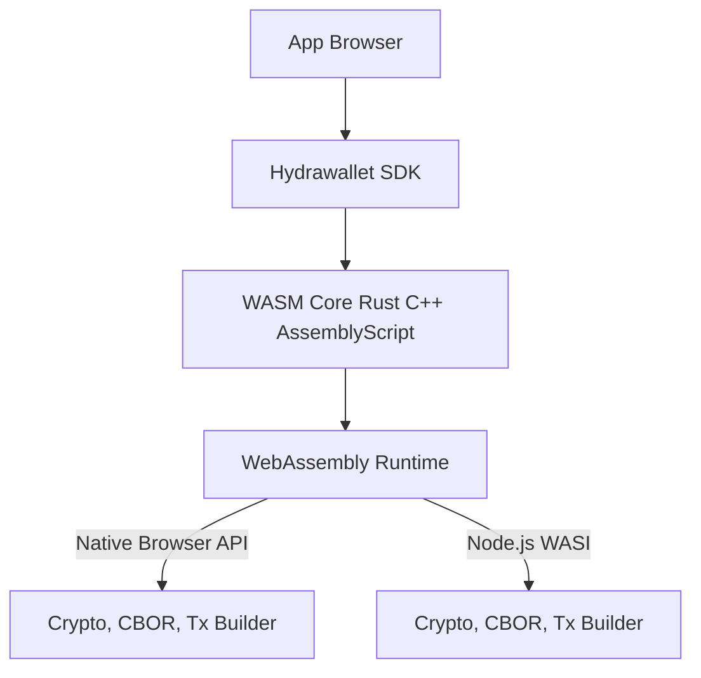

# Technical Report: Polyfill and Bundling Issues with @cardano-sdk and MeshJS

## 1. Context

Hydrawallet SDK initially relied on **`@cardano-sdk`** to leverage functionalities such as:

- Keypair and address management
- Transaction operations
- Hashing/cryptography
- Bech32 formatting and blockchain data handling

The deployment environment was **Nuxt 3 + Vite** (ESM-first, browser-based).

In the Cardano ecosystem, **MeshJS SDK** is also used to build dApps. However, **MeshJS** uses `@cardano-sdk` as its **core package** for many critical functionalities. This leads to **MeshJS encountering similar issues** when running in modern browser environments.

## 2. Issues Encountered

When building Hydrawallet SDK or MeshJS SDK with `@cardano-sdk` in a browser environment, the following typical issues occur:

### 2.1. **Node.js Environment Issues**

`@cardano-sdk` is primarily written for Node.js, with many modules directly importing **Node core modules**, for example:

```tsx
import * as crypto from 'crypto';
import * as util from 'util';
import { Readable } from 'stream';
import { readFileSync } from 'fs';
```

These modules exist in the Node.js runtime but **do not exist in browsers**.

List of Node core modules used:

```
crypto, util, stream, buffer, assert, process, events, fs, path
```

### 2.2. **Vite/Rollup Does Not Automatically Polyfill Node Core Modules**

- Webpack 4 (previously) automatically injected polyfills (browserify) for Node modules.
- **Vite/Rollup**: by default, **does not** polyfill → when encountering `require('crypto')` or `import util from 'util'`:
    - Build fails (`Module not found`)
    - Or bundles to the browser with `require` → browser crashes.

### 2.3. **Imperfect ESM ↔ CommonJS Interop**

Some dependencies like `serialize-error` only export CommonJS:

```jsx
module.exports = { serializeError, deserializeError };
```

When using ESM import:

```tsx
import serializeError from 'serialize-error';
```

Vite converts → `serializeError.default`, but `.default` does not exist →

`Uncaught TypeError: import_serialize_error.default is not a function`.

### 2.4. **`exports is not defined` Error**

When a CJS file is not transpiled, it runs as-is:

```jsx
exports.foo = ...
```

Browsers do not have the `exports` variable → crashes immediately upon loading.

### 2.5. **MeshJS Faces Similar Issues**

- MeshJS currently **packages and exposes many components of `@cardano-sdk`**.
- When using MeshJS SDK in browsers (Vite/Nuxt), it also encounters **the same set of issues**, such as:
    - `exports is not defined`
    - `import_xxx.default is not a function`
    - Missing Node core modules (`crypto`, `stream`, `util`, …)
- Polyfills can partially resolve the issue, but the bundle becomes **very large** and still cannot guarantee 100% functionality as some APIs (`fs`, `net`) cannot be emulated in browsers.
- Reported issue:

[https://github.com/MeshJS/mesh/issues/698](https://github.com/MeshJS/mesh/issues/698)

### 2.6. **Consequences**

- Requires **polyfilling the entire Node API** to run → extremely large bundle (hundreds of KB).
- Some modules cannot be fully polyfilled (e.g., `fs`, `net`) → functionality does not work in browsers.
- Difficult to optimize tree-shaking due to scattered Node imports → bundles contain unused code.

## 3. Why WASM is the Optimal Solution

### 3.1. **Eliminates Node Core Module Dependencies**

- WebAssembly (WASM) enables writing high-performance functionalities (crypto, bech32, CBOR, transaction builder) **without relying on the Node environment**.
- All logic runs in WASM’s sandbox → a single binary can be used for both Node.js and browsers.

---

### 3.2. **Reduces Bundle Size**

- Only loads necessary functions in the `.wasm` file → avoids polyfilling the entire Node API.
- No need to load polyfill libraries like `crypto-browserify`, `stream-browserify`, `util`...

---

### 3.3. **Boosts Performance**

- Crypto and transaction parsing in WASM run **near native speed**.
- Reduces JS overhead when handling buffer/Uint8Array.

---

### 3.4. **Easy Maintenance and Cross-Platform**

- A single WASM codebase → runs on:
    - Browser (WebAssembly)
    - Node.js (WASI or wasm-bindgen)
    - Mobile apps (via bridge)
- No need to handle CJS/ESM interop.

---

## 4. Conclusion

Using `@cardano-sdk` in Hydrawallet SDK or MeshJS SDK for browser environments faces the following challenges:

1. **Directly imports Node core modules** → unsupported in browsers.
2. **Vite/Rollup does not auto-polyfill** → requires manual configuration, large bundles.
3. **Complex CJS/ESM interop** → runtime errors (`exports is not defined`, `.default is not a function`).
4. **Some modules cannot be polyfilled** → features become unavailable.
5. **MeshJS SDK** inherits **all these issues** due to its dependency on `@cardano-sdk`.

**Solution**: Transition to **WebAssembly** for critical components:

- Eliminates Node core module dependencies.
- Reduces bundle size.
- Boosts performance.
- Ensures cross-platform compatibility.

Hydrawallet SDK will build Cardano core modules (CBOR, crypto, address, transaction) using **Rust + wasm-bindgen** or **C/C++ + Emscripten** to completely replace the dependency on `@cardano-sdk` for browser environments, while avoiding the bundling issues faced by MeshJS.

## 5. Comparison of Cardano SDK Solutions for Browser Environments

### 5.1 Comparison Table

| Criteria | **@cardano-sdk + Polyfill** | **MeshJS SDK** (based on @cardano-sdk) | **Hydrawallet SDK** (WASM-based) |
| --- | --- | --- | --- |
| **Browser Compatibility** | Can run but requires polyfilling Node core modules; some APIs (`fs`, `net`) are unavailable. | Similar to @cardano-sdk as it inherits all core code; runtime errors without polyfills. | Native browser support; no Node polyfills needed. |
| **Bundle Size** | Very large (hundreds of KB – >1MB) due to polyfills. | Large, similar to @cardano-sdk, with additional overhead from MeshJS wrapper code. | Smaller (only loads .wasm + JS glue code). |
| **Node Environment Dependency** | High, directly imports Node core modules. | High, as it uses @cardano-sdk as its core. | None; all core logic resides in WASM. |
| **Interop (ESM/CJS)** | Prone to errors (`exports is not defined`, `.default is not a function`). | Similar issues, harder to debug due to additional abstraction layers. | No issues; pure ESM JavaScript. |
| **Crypto/CBOR Performance** | Moderate (pure JS, dependent on low-performance polyfills). | Moderate. | High (WASM near native speed). |
| **Cross-Platform Support** | Good for Node.js, limited for browsers. | Similar to @cardano-sdk. | Excellent; works on browsers, Node.js, and mobile via WASM bridge. |
| **Tree-Shaking** | Limited, as Node imports are scattered, leading to unused code in bundles. | Worse due to additional wrapper code. | Excellent; only required WASM functions are bundled. |
| **Maintenance & Scalability** | Complex, as it requires tracking Node API changes and polyfills. | More complex due to dependency on upstream @cardano-sdk and MeshJS wrapper. | Easy to maintain, with core logic implemented in Rust/C++ and exposed via WASM. |

### 5.2 Dependency Flow Diagrams

1. **MeshJS SDK & @cardano-sdk**



**Issues:**

- `@cardano-sdk` directly imports `crypto`, `util`, `stream`, `fs`, `net`...
- Vite/Rollup does not auto-polyfill → build fails or runtime errors.
- Some modules cannot be fully polyfilled (e.g., `fs`, `net`) → functionality does not work.

2. **Hydrawallet SDK (WASM-based)**



**Advantages:**

- No dependency on Node core modules.
- Runs directly on browsers and Node.js.
- High performance, small bundle size.
- Easy tree-shaking and cross-platform compatibility.
