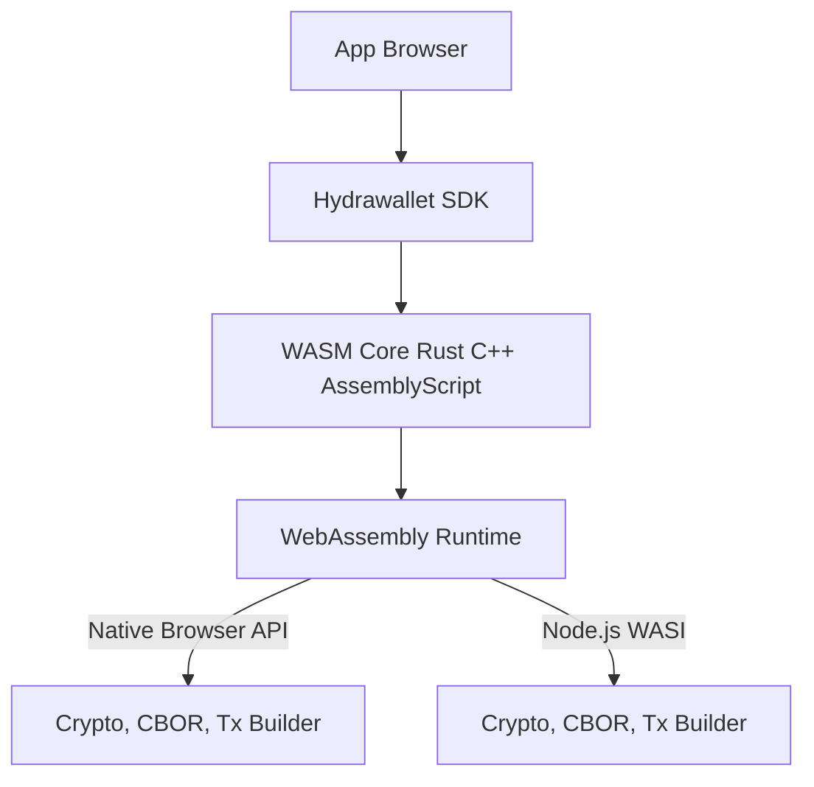

# BÁO CÁO KỸ THUẬT

# Nguyên nhân không thể bundle `@cardano-sdk` cho browser và lý do lựa chọn WASM cho Hydrawallet SDK

## 1. Bối cảnh

Hydrawallet SDK ban đầu dựa trên **`@cardano-sdk`** nhằm tận dụng các chức năng:

- Quản lý keypair và address
- Thao tác giao dịch
- Hashing / cryptography
- Định dạng bech32 và xử lý dữ liệu blockchain

Môi trường triển khai là **Nuxt 3 + Vite** (ESM-first, chạy browser).

Trong hệ sinh thái Cardano, **MeshJS SDK** cũng đang được sử dụng để xây dựng dApps. Tuy nhiên, **MeshJS** lại sử dụng `@cardano-sdk` làm **core package** cho nhiều chức năng quan trọng. Điều này dẫn đến việc **MeshJS gặp lỗi tương tự** khi chạy trên môi trường browser hiện đại.

## 2. Vấn đề gặp phải

Khi build Hydrawallet SDK hoặc MeshJS SDK với `@cardano-sdk` trong môi trường browser, xảy ra các lỗi điển hình:

### 2.1. **Lỗi môi trường Node.js**

`@cardano-sdk` được viết chủ yếu cho Node.js, với nhiều module import trực tiếp **Node core modules**, ví dụ:

```tsx
import * as crypto from 'crypto';
import * as util from 'util';
import { Readable } from 'stream';
import { readFileSync } from 'fs';
```

Các module này tồn tại trong Node.js runtime, **không tồn tại trên browser**.

Danh sách Node core modules xuất hiện:

```
crypto, util, stream, buffer, assert, process, events, fs, path
```

### 2.2. **Vite/Rollup không tự động polyfill Node core modules**

- Webpack 4 (trước đây) tự động inject polyfill (browserify) cho các module Node.
- **Vite/Rollup**: mặc định **không** polyfill → khi gặp `require('crypto')` hoặc `import util from 'util'`:
    - Build sẽ lỗi (`Module not found`)
    - Hoặc bundle ra browser với `require` → browser crash.

### 2.3. **Interop giữa ESM ↔ CommonJS không hoàn hảo**

Một số dependency như `serialize-error` chỉ export CommonJS:

```jsx
module.exports = { serializeError, deserializeError };
```

Khi dùng ESM import:

```tsx
import serializeError from 'serialize-error';
```

Vite sẽ convert → `serializeError.default` nhưng `.default` lại không tồn tại →

`Uncaught TypeError: import_serialize_error.default is not a function`.

### 2.4. **Lỗi `exports is not defined`**

Khi một file CJS không được transpile, nó chạy nguyên bản:

```jsx
exports.foo = ...
```

Browser không có biến `exports` → crash ngay khi load.

### 2.5. **MeshJS gặp lỗi tương tự**

- MeshJS hiện tại **gói và expose lại nhiều thành phần của `@cardano-sdk`**.
- Khi sử dụng MeshJS SDK trong browser (Vite/Nuxt), cũng sẽ gặp **cùng một loạt lỗi** như:
    - `exports is not defined`
    - `import_xxx.default is not a function`
    - Missing Node core modules (`crypto`, `stream`, `util`, …)
- Polyfill có thể giải quyết một phần, nhưng bundle sẽ **rất lớn** và vẫn không đảm bảo chạy được 100% do một số API (`fs`, `net`) không thể giả lập trong browser.
- Issue đã báo cáo:

[https://github.com/MeshJS/mesh/issues/698](https://github.com/MeshJS/mesh/issues/698)

### 2.6. **Hệ quả**

- Cần **polyfill toàn bộ Node API** để chạy được → bundle cực lớn (hàng trăm KB).
- Một số module không thể polyfill đầy đủ (vd `fs`, `net`) → chức năng không chạy được trên browser.
- Khó tối ưu tree-shaking do các import Node nằm rải rác → bundle chứa code thừa.

## 3. Tại sao WASM là giải pháp tối ưu

### 3.1. **Loại bỏ phụ thuộc vào Node core modules**

- WebAssembly (WASM) cho phép viết các chức năng cần hiệu năng cao (crypto, bech32, CBOR, transaction builder) **mà không phụ thuộc môi trường Node**.
- Tất cả logic chạy trong sandbox của WASM → cùng 1 binary dùng được cả Node.js và browser.

---

### 3.2. **Giảm kích thước bundle**

- Chỉ load các hàm cần thiết trong `.wasm` file → tránh polyfill nguyên Node API.
- Không cần tải các thư viện polyfill như `crypto-browserify`, `stream-browserify`, `util`...

---

### 3.3. **Tăng hiệu năng**

- Crypto và parsing giao dịch trên WASM chạy **gần native speed**.
- Giảm overhead JS khi xử lý buffer/Uint8Array.

---

### 3.4. **Dễ dàng maintain và cross-platform**

- Một codebase WASM → chạy trên:
    - Browser (WebAssembly)
    - Node.js (WASI hoặc wasm-bindgen)
    - Mobile app (thông qua bridge)
- Không cần xử lý interop CJS/ESM.

---

## 4. Kết luận

Những trở ngại của các SDK dựa trên @cardano-sdk khi chạy trên browser:

1. **Import trực tiếp Node core modules** → browser không hỗ trợ.
2. **Vite/Rollup không auto-polyfill** → cần cấu hình thủ công, bundle to.
3. **Interop CJS/ESM phức tạp** → phát sinh lỗi runtime (`exports is not defined`, `.default is not a function`).
4. **Một số module không thể polyfill** → tính năng không khả dụng.
5. **MeshJS SDK** vì phụ thuộc `@cardano-sdk` nên **thừa hưởng toàn bộ các vấn đề trên**.

**Giải pháp**: Chuyển sang **WebAssembly** cho các thành phần quan trọng:

- Loại bỏ phụ thuộc Node core modules.
- Giảm bundle size.
- Tăng hiệu năng.
- Đảm bảo cross-platform.

Hydrawallet SDK sẽ build các module Cardano core (CBOR, crypto, address, transaction) bằng **Rust + wasm-bindgen** hoặc **C/C++ + Emscripten** để thay thế hoàn toàn phần phụ thuộc `@cardano-sdk` cho môi trường browser, đồng thời tránh được các vấn đề của MeshJS khi bundle.

## 5. So sánh các giải pháp SDK Cardano cho môi trường browser

### 5.1 Bảng so sánh

| Tiêu chí | **@cardano-sdk + Polyfill** | **MeshJS SDK** (dựa trên @cardano-sdk) | **Hydrawallet SDK** (WASM-based) |
| --- | --- | --- | --- |
| **Khả năng chạy trên browser** | Có thể chạy nhưng cần polyfill Node core modules; một số API không khả dụng (`fs`, `net`). | Tương tự @cardano-sdk vì kế thừa toàn bộ core code; gặp lỗi runtime nếu thiếu polyfill. | Native browser support; không cần polyfill Node. |
| **Kích thước bundle** | Rất lớn (hàng trăm KB – >1MB) do phải polyfill `crypto`, `stream`, `buffer`, v.v. | Lớn tương tự @cardano-sdk, cộng thêm overhead từ code wrapper của MeshJS. | Nhỏ gọn hơn (chỉ load .wasm + JS glue code). |
| **Phụ thuộc môi trường Node** | Cao, import trực tiếp Node core modules. | Cao, do sử dụng @cardano-sdk làm core. | Không, toàn bộ logic core nằm trong WASM. |
| **Interop ESM/CJS** | Dễ lỗi (`exports is not defined`, `.default is not a function`). | Gặp lỗi tương tự, khó debug hơn do nhiều lớp abstraction. | Không bị, code JS thuần ESM. |
| **Hiệu năng xử lý crypto/CBOR** | Trung bình (JS thuần, phụ thuộc polyfill hiệu suất thấp). | Trung bình. | Cao (WASM gần native speed). |
| **Khả năng cross-platform** | Node.js tốt, browser hạn chế. | Tương tự @cardano-sdk. | Chạy tốt trên browser, Node.js, mobile qua WASM bridge. |
| **Khả năng tree-shaking** | Hạn chế, do nhiều import Node nằm rải rác → dễ bundle thừa code. | Hạn chế hơn nữa vì wrap thêm các module từ @cardano-sdk. | Tốt, chỉ bundle các hàm WASM cần thiết. |
| **Bảo trì & mở rộng** | Phức tạp do phải theo dõi các thay đổi từ Node API và polyfill. | Phức tạp hơn vì phụ thuộc upstream @cardano-sdk và MeshJS wrapper. | Dễ bảo trì, chủ động code core logic bằng Rust/C++ và expose qua WASM. |

### 5.2 Sơ đồ luồng dependency

1. **MeshJS SDK & @cardano-sdk**

```mermaid
graph TD
    A[App Browser] --> B[MeshJS SDK]
    B --> C[@cardano-sdk]
    C --> D[Node Core Modules]
    D -->|Yêu cầu Polyfill| E[crypto-browserify, stream-browserify, buffer, util...]
    E -->|Tăng Bundle Size| F[Lỗi Runtime khi thiếu polyfill]
    D -->|Không thể Polyfill| G[fs, net -> Không chạy được]
```

**Vấn đề:**

- `@cardano-sdk` import trực tiếp `crypto`, `util`, `stream`, `fs`, `net`...
- Vite/Rollup không auto-polyfill → build fail hoặc runtime error.
- Một số module không thể polyfill hoàn toàn (vd `fs`, `net`) → chức năng không hoạt động.

2. **Hydrawallet SDK (WASM-based)**



**Ưu điểm:**

- Không phụ thuộc Node core modules.
- Chạy trực tiếp trên browser và Node.js.
- Hiệu năng cao, bundle nhỏ.
- Dễ tree-shaking và cross-platform.
